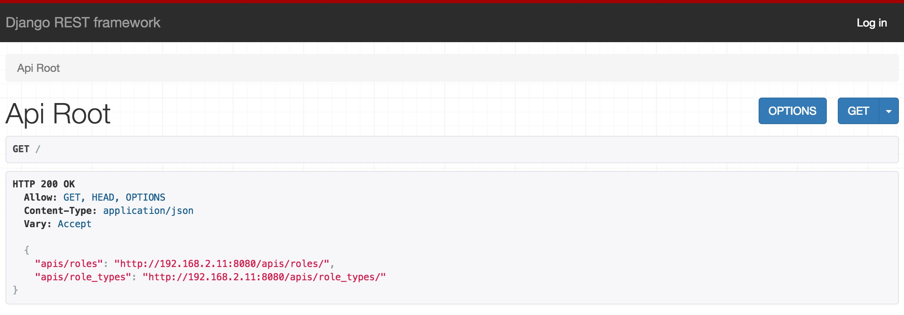
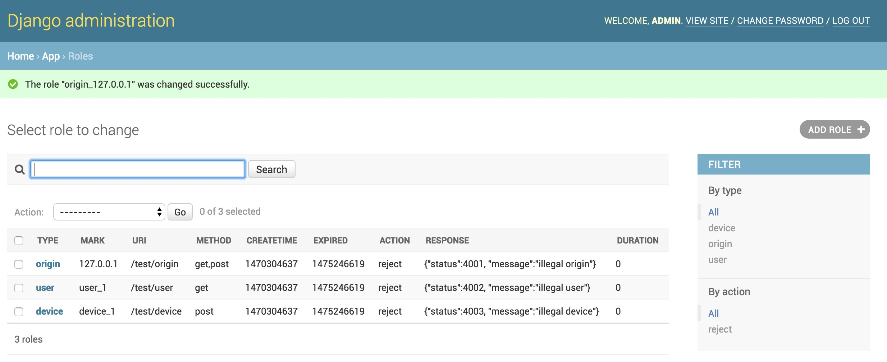

# httptables-manager
httptables-manager is a simple model-backed API, to provide management services for [httptables](https://github.com/WALL-E/httptables)

`default port`: 10085

## Compatibility of Operating System

* Centos7

## Technology Stack

* Python3
* MySQL
* Django1.95


## Restful API
create two read-write API for accessing information on the rule_types and rules

* http://127.0.0.1:10085/apis/rule_types
* http://127.0.0.1:10085/apis/rules




## Install

1. install base package

      run **depends.sh**

2. start MySQL 

      **systemctl start mariadb**

3. create database

      **CREATE DATABASE httptables CHARACTER SET utf8;**

4. import SQL

      MariaDB [(none)]> **use httptables**
      
      MariaDB [httptables]> **source httptables.dump.sql**

      **note**:
      * default user:`admin`
      * default password: `123456@admin`

5. start django

      run **manager/run.sh**

you can now open the API in your browser at http://127.0.0.1:10085/, and view  'rule_types' and 'rules' API. If you use the login control in the top right corner you'll also be able to add, create and delete rule_types,rules from the system.


## Integration with httptables
open manager/project/setting.py, modify the value of the HTTPTABLES_NOTIFY_URL.

```
HTTPTABLES_NOTIFY_URL=["http://172.28.32.105:8001/admin/notify"]
```

`172.28.32.105` is httptables's ip address, if you have multiple httptables, need to be added to this list.

## Django admin
One of the most powerful parts of Django is the automatic admin interface, the admin is enabled in the default, you can easily use if needed. you can now open the Admin page in your browser at http://127.0.0.1:10085/admin


